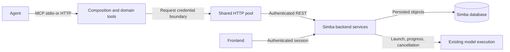

# MCP architecture and compatibility

## Responsibilities

`server.py` composes the SDK server and explicitly registers tool functions with
standard MCP titles and effect hints. `runtime.py` owns environment configuration,
lifespan and ASGI construction; the CLI selects transports. `auth.py` binds each
hosted request's bearer token and enforces local-file restrictions. `api_client.py`
owns the shared HTTP pool and request/retry handling. `errors.py` describes safe
transport failures; `schemas/` describes wire objects. `tools/` groups data,
projects, models, results, optimizer/scenarios, studies, recipes and quality.

No studies, hashes, recipes, lineage, policies, evaluations or decisions are stored
in MCP files. Backend services enforce permission, revision, subscription, budget
and scientific validation. Annotation hints never authorize actions. There is no
second job engine, business validator or model mathematics here.

The SDK is MCP Python >=2.1,<3. The inspected 2.2.0 `MCPServer.add_tool` supports
`title`, `ToolAnnotations` and structured outputs. Tests also exercise the 2.1.0
floor. The [MCP tools specification](https://modelcontextprotocol.io/specification/2025-11-25/server/tools)
requires structured outputs to match their advertised schema and describes
annotations as hints. Official specification and installed SDK source inspected
19 September 2026; web access to the SDK v2 migration site was unavailable.

## Request and recovery

A hosted call receives its own bearer key via a task-local ContextVar; the shared
client has no environment-key fallback. Backend authorization remains definitive.
Stdio uses the operator's configured key. HTTP/SSE local file access is disabled
unless explicitly enabled by the operator. The 12 MiB transport cap accommodates
the existing 10 MiB CSV ingest limit. Deployment hosts still configure proxies.

Reads retry transient failures up to three attempts. Writes are sent once even
when their annotation is idempotent. After an uncertain study launch, inspect the
run history and reuse the identical submission key and inputs. That required key
makes launch idempotent; a new key means a new intentional attempt. Other uncertain
writes require reconciliation before repetition. Poll shared run state after
cancellation: a request to stop is distinct from confirmed completion.

## Compatibility

All 50 previous tool names, required parameters and default payloads remain.
Existing Python tool imports from `simba_mcp.server` and the CLI/ASGI entry points
remain. Private implementation/monkeypatch locations moved to their owning modules.
The extraction is a separate commit from contract changes.

Additions: `get_backend_capabilities`; optional `expected_content_hash` on recipe
create/revise; optional `max_response_bytes` on result retrieval; standard metadata;
permissive object/property descriptions for recipes, channels, control priors,
quality checks and results. Backend dictionaries and unknown additive fields are
preserved, including optional/missing evidence. Known extensible vocabularies use
examples and prose, not a closed MCP-side enum that rejects a newer backend.
Backend request validation remains authoritative.

Intentional reliability changes: mutating requests are no longer automatically
retried; HTTP errors include additive `_error_code` and `_next_action`; non-object
errors, malformed JSON and transport failures become safe dictionaries. Raw
transport exception messages and non-JSON gateway error bodies are not exposed.
MCP log messages omit request paths, bodies and credentials. Existing tool-level
`ToolError` for an unsupported control-prior preflight remains unchanged.

A refused backend call is a tool execution error on the wire: `isError` is true and
the structured payload (`error`, `_status_code`, `_error_code`, `_next_action`) is
unchanged, so clients may read either. Arguments that fail a tool's input schema
return the same envelope with `_error_code` `invalid_arguments` (422). Output schemas
intentionally do not require evidence that older backends may omit. Structured JSON
and text representations are both verified on the wire.

Result defaults remain full fidelity. Use sections, channels and max_grid_points
first; optional max_response_bytes checks the UTF-8 JSON payload after filtering
and returns 413 without partial evidence. It does not bound the HTTP download or
MCP envelope overhead. List-model/upload/run APIs already expose limit/offset;
Studies history remains backend-unpaginated. Prefer exact recipe revisions and
run IDs. Do not treat filtered/downsampled displays as full scientific evidence.

Discovery reads the connected authenticated backend schema each time, preserving
unknown advertisements. Missing namespaces or nested fields mean unknown, not
unsupported. It never infers features from this package's version. Advertisements
describe deployed API vocabulary, not authorization, readiness or job success.

## Acceptance and rollback

The schema snapshot pins the deliberate additions. Tests cover registration,
metadata effects, forwarding, unknown fields, structured wire results, capability
fallback, caller isolation, retry behavior, log safety, local-file restrictions,
CLI transport options, ASGI calls and an actual stdio handshake. Test mocks are not
live backend or scientific-model acceptance. Reverting the MCP commits restores
the previous adapter; additive backend advertisements can remain or be reverted
independently. No persisted state migration is involved.
