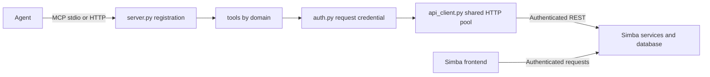

# MCP architecture and compatibility

The MCP is a transport adapter to Simba's authenticated API. Simba owns model
execution, permissions, budgets and durable study/recipe/evaluation/decision state.
The frontend and MCP operate on those same records.

## Responsibilities

- `server.py`: SDK construction, explicit registration and compatible public imports.
- `runtime.py`: shared process lifespan, package version, HTTP body limit and ASGI setup.
- `auth.py`: caller-local credentials and network-mode filesystem safeguards.
- `tools/`: data, projects, models, results, scenarios, studies, recipes, quality and discovery.
- `schemas/`: typed discovery output; existing response objects stay extensible.
- `errors.py`: additive transport/error guidance; no permissions or business validation.

Tool modules register directly with the SDK. There is no second registry, YAML
manifest, dispatcher or job engine. Client credentials never become shared mutable
lifespan state. Capability reads are not cached across callers. HTTP defaults to
rejecting local file access and never falls back to a shared environment key.

## Agent contract

`get_capabilities` reads `/api/v1/ingest/schema` and preserves the backend's
`x-simba-model-capabilities` object, including future fields. Missing categories are
unknown; a missing declaration does not prove lack of support. Control transforms
are specific to controls and do not establish media transformation support.
An authentication failure is unavailable discovery, not an empty supported feature
set. Feature availability is separate from caller permissions and model validity.

Every tool has explicit standard annotations. Preview/confirm adoption and pin
toggle operations are conservatively write/non-idempotent. Study launch is
idempotent only with the same submission key and inputs. Open-world hints remain
true because results come from an external backend and may contain user-authored
text; clients must not treat it as trusted instructions. Annotations never enforce
permissions or override the backend.

Old response dictionaries remain dictionaries, with arbitrary backend fields
preserved. Parameter descriptions add units and prerequisite guidance without
copying the backend's validators. Typed dictionary return annotations provide
extensible object output schemas and structured content alongside text. Discovery
has a more specific typed output contract.

## Failure and retry semantics

GET requests retain bounded retries. Mutations are sent once: a timeout may mean
the server committed successfully. Read current state before resubmitting. A study
launch retry must retain revision, policy and submission key; cancellation calls
the existing service and distinguishes requested from confirmed stopped.

Errors retain `error`, `_status_code`, `_help` and backend fields, with additive
`_mcp_error` classification, transient flag, safe-to-retry flag and next action.
Transport exception messages and gateway HTML are not returned or logged. Structured
backend errors remain authoritative. CSV exports retain their text wrapper.

## Bounded retrieval

Use sections, channels and max_grid_points for model results. Workflow list tools
accept optional keyword-only limit/offset; omitted arguments preserve legacy output.
Their `_mcp_page` explicitly reports client-side slicing: this limits agent output,
not backend query/network cost. Pages are not a stable snapshot; concurrent writes
can move boundaries. Server-side pagination would require coordinated API/UI work.

## Migration and validation

The first commit only extracts modules; follow-up changes add contracts and retry
safeguards. Public tool names, defaults, required fields, CLI transports and
`simba_mcp.server:app` remain available. Private monkeypatch locations move to the
module that owns the state. New optional pagination, discovery, annotations,
descriptions and structured output are intentional additive wire changes. Automatic
write retries are intentionally removed for safety.

Tests cover existing endpoint mappings, old input compatibility, wire schemas,
mixed-action annotations, per-caller discovery, malformed errors, uncertain writes,
HTTP authentication and local-file restrictions. CI covers Python 3.11–3.13. No
model fitting or deployment is required to validate this adapter refactor.

Sources checked 2026-09-19: installed `mcp` 2.2.0 (declared minimum 2.1),
[official SDK](https://github.com/modelcontextprotocol/python-sdk) and
[tool specification](https://modelcontextprotocol.io/specification/2025-11-25/server/tools).
Annotations are hints; structured outputs must conform to their output schema.
