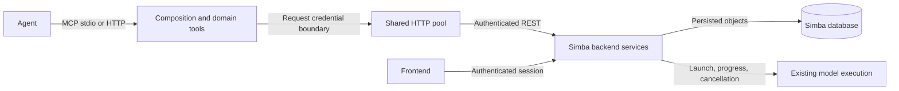

# MCP architecture and compatibility

## Responsibilities

`server.py` composes the SDK server and explicitly registers tool functions with
standard MCP titles and effect hints. `runtime.py` owns environment configuration,
lifespan and ASGI construction; the CLI selects transports. `auth.py` binds each
hosted request's bearer token and enforces local-file restrictions. `api_client.py`
owns the shared HTTP pool and request/retry handling. `user_profiles.py` resolves
the hosted caller's persisted profile through SDK middleware, filters each listing
response and rejects excluded calls without mutating the shared catalogue.
`errors.py` describes safe
transport failures; `schemas/` describes wire objects. `tools/` groups data,
projects, models, results, optimizer/scenarios, studies, recipes and quality.
`configuration.py` records those shipped controls and prints the effective combination
without secrets. It does not replace runtime resolution or add an MCP admin tool.

```mermaid
flowchart LR
    Agent -->|MCP stdio or HTTP| Server[Composition and domain tools]
    Server -->|Request credential boundary| Client[Shared HTTP pool]
    Client -->|Authenticated REST| API[Simba backend services]
    Frontend -->|Authenticated session| API
    API -->|Persisted objects| DB[(Simba database)]
    API -->|Launch, progress, cancellation| Jobs[Existing model execution]
```

No studies, hashes, recipes, lineage, policies, evaluations or decisions are stored
in MCP files. Backend services enforce permission, revision, subscription, budget
and scientific validation. Annotation hints never authorize actions. There is no
second job engine, business validator or model mathematics here.

The current package pins MCP Python >=2.1.1,<2.2. The inspected 2.1.1 SDK supports
`title`, `ToolAnnotations`, structured outputs and request middleware.
The [MCP tools specification](https://modelcontextprotocol.io/specification/2025-11-25/server/tools)
requires structured outputs to match their advertised schema and describes
annotations as hints. Official specification and installed SDK source inspected
19 September 2026; web access to the SDK v2 migration site was unavailable.

## Request and recovery

A hosted call receives its own bearer key via a task-local ContextVar; the shared
client has no environment-key fallback. Backend authorization remains definitive.
Stdio uses the operator's configured key. HTTP/SSE local file access is disabled
unless explicitly enabled by the operator. The 12 MiB transport cap accommodates
the existing 10 MiB CSV ingest limit. Deployment hosts still configure proxies.

Reads retry transient failures up to three attempts. Writes are sent once even
when their annotation is idempotent. After an uncertain study launch, inspect the
run history and reuse the identical submission key and inputs. That required key
makes launch idempotent; a new key means a new intentional attempt. Other uncertain
writes require reconciliation before repetition. Poll shared run state after
cancellation: a request to stop is distinct from confirmed completion.

## Authentication modes

The server never issues credentials. It authenticates each HTTP request with the caller's own bearer and forwards that bearer to the backend unchanged.

- **Bring-your-own-key (default).** `Authorization: Bearer simba_sk_…` per request; no server-side shared key. `initialize` answers without a bearer. Both `tools/list` and `tools/call` require a bearer and a successful preferences lookup.
- **OAuth resource-server mode (`MCP_OAUTH_ENABLED=1`, from 0.12.0).** The SDK's resource-server mode (`mcp` 2.1.1, the MCP authorization specification it implements): the server serves `/.well-known/oauth-protected-resource/mcp` naming the backend as the authorization server, and answers 401 with `WWW-Authenticate: Bearer resource_metadata=…` to any request without a verified bearer, including `initialize` and `tools/list`. Each bearer is verified by `GET {SIMBA_API_URL}/api/v1/auth/token-info` **with that same bearer**; the server holds no secret. OAuth access tokens and API keys both verify. A positive answer is cached for at most 60 seconds under a SHA-256 of the token, never the token; a negative answer is not cached; a backend timeout or 5xx is a 401, never a crash. Scopes are not enforced at this boundary; the backend enforces them per route, as it does for keys. The MCP and the API are one protected resource with one audience, so forwarding is passthrough to the same resource. `SIMBA_PUBLIC_URL` names the issuer and the resource.

## Compatibility

The new hosted profile contract requires the matching application release and its
`/api/v1/mcp/preferences` endpoint. There is no older-backend fallback. The application
must authenticate the supplied bearer on this endpoint as well as tool routes.
The matching application uses its existing canonical resolver for API keys and
OAuth access tokens, and supports session-only preference updates protected by
CSRF. Local synthetic SQLite and in-process HTTP integration checks verify both
bearer paths through preference lookup, per-user tool listing and excluded-call
refusal. They do not establish deployed-host acceptance. See the coordinated
publication, application dependency pin, migration and canary gates in
[tool profiles](tool-profiles.md#configure-a-connection).

All 50 previous tool names, required parameters and default payloads remain.
Existing Python tool imports from `simba_mcp.server` and the CLI/ASGI entry points
remain. Private implementation/monkeypatch locations moved to their owning modules.
The extraction is a separate commit from contract changes.

Additions: `get_backend_capabilities`; optional `expected_content_hash` on recipe
create/revise; optional `max_response_bytes` on result retrieval; standard metadata;
permissive object/property descriptions for recipes, channels, control priors,
quality checks and results. Backend dictionaries and unknown additive fields are
preserved, including optional/missing evidence. Known extensible vocabularies use
examples and prose, not a closed MCP-side enum that rejects a newer backend.
Backend request validation remains authoritative.

Intentional reliability changes: mutating requests are no longer automatically
retried; HTTP errors include additive `_error_code` and `_next_action`; non-object
errors, malformed JSON and transport failures become safe dictionaries. Raw
transport exception messages and non-JSON gateway error bodies are not exposed.
MCP log messages omit request paths, bodies and credentials. Existing tool-level
`ToolError` for an unsupported control-prior preflight remains unchanged.

A refused backend call is a tool execution error on the wire: `isError` is true and
the structured payload (`error`, `_status_code`, `_error_code`, `_next_action`) is
unchanged, so clients may read either. Arguments that fail a tool's input schema
return the same envelope with `_error_code` `invalid_arguments` (422). Output schemas
intentionally do not require evidence that older backends may omit. Structured JSON
and text representations are both verified on the wire.

Result defaults remain full fidelity. Use sections, channels and max_grid_points
first; optional max_response_bytes checks the UTF-8 JSON payload after filtering
and returns 413 without partial evidence. It does not bound the HTTP download or
MCP envelope overhead. List-model/upload/run APIs already expose limit/offset;
Studies history remains backend-unpaginated. Prefer exact recipe revisions and
run IDs. Do not treat filtered/downsampled displays as full scientific evidence.

Discovery reads the connected authenticated backend schema each time, preserving
unknown advertisements. Missing namespaces or nested fields mean unknown, not
unsupported. It never infers features from this package's version. Advertisements
describe deployed API vocabulary, not authorization, readiness or job success.

## Acceptance and rollback

The schema snapshot pins the deliberate additions. Tests cover registration,
metadata effects, forwarding, unknown fields, structured wire results, capability
fallback, caller isolation, retry behavior, log safety, local-file restrictions,
CLI transport options, ASGI calls and an actual stdio handshake. Test mocks are not
live backend or scientific-model acceptance. Reverting the MCP commits restores
the previous adapter; additive backend advertisements can remain or be reverted
independently for adapter-only changes. This release also adds the application's
persisted user profile column. Apply the companion application's migration
`mcp_tool_profile_001` before starting the new application and MCP together.
Keep the additive column during code rollback to preserve saved preferences;
downgrading the migration removes them. Reconnect clients after changing a profile
or restoring the previous deployment. Reconnection does not undo submitted writes.
