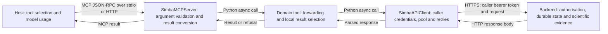
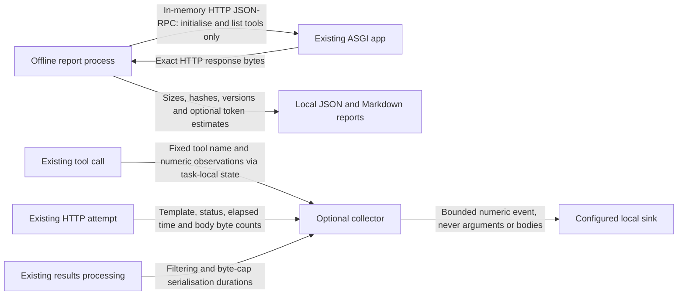

# Performance measurement and evaluation design

Reviewed 29 September 2026 against `03dd97b570ffa23de260aabe404d4382789f5d41`.
Scope: [PERF-01 / #39](https://github.com/getsimba-ai/simba-mcp/issues/39) and the
handover to [PERF-02 / #40](https://github.com/getsimba-ai/simba-mcp/issues/40), within
[epic #38](https://github.com/getsimba-ai/simba-mcp/issues/38).

## Recommendation

Measure the current catalogue and request path before selecting optimisations.
Add an offline report of the actual HTTP MCP `initialize` and `tools/list` responses,
plus optional aggregate observations around the existing tool, HTTP and results
boundaries. Preserve the tool catalogue, credentials, response envelopes and retry
rules. Build workflow evaluations on the resulting measurements in PERF-02.

The strongest tradeoff is measurement overhead: counting serialised results needs
additional serialisation when enabled. Keep this opt-in, measure its cost, distinguish
measurement time from handler time, and never infer production latency from a mock
backend. No numerical speedup or model-quality threshold has been established.

## Evidence and current system

| Claim | Status and evidence | Consequence |
| --- | --- | --- |
| The composition root registers 80 tools and exposes instructions | Observed locally: `server.py:TOOLS`, `mcp`; `reference.py:current` | Read live SDK output; do not count characters in source files |
| Hosted requests share one HTTP pool, while credentials use a ContextVar | Observed locally: `runtime.py:app_lifespan`, `auth.py:_client`, `api_client.py:CALLER_API_KEY` | Observations must be task-local and contain no caller identity |
| GET/HEAD can retry; writes default to one attempt | Observed locally: `SimbaAPIClient._request` | Observe every attempt without changing replay or recovery semantics |
| The results byte cap is after download and filtering | Observed locally: `tools/results.py:get_model_results` | Distinguish HTTP body, decoded body, tool content and MCP representation |
| SDK tracing already exists and is inert without a configured OTel SDK | Documented: SDK OpenTelemetry guide; observed dependency `opentelemetry-api` | Do not install a tracing service or duplicate its transport implementation |
| HTTPX response hooks run before the body is necessarily consumed | Documented: HTTPX event-hooks guide | Observe after the existing awaited request; do not read the body in a hook |
| A smaller catalogue improves this application's task performance | Unverified | Requires repeated host/model trials in PERF-02 and later comparisons |

The host owns discovery, model prompting and model token accounting. MCP executes
tools; it cannot establish what definitions a host actually sent to a model.
Backend validation and durable workflow state remain authoritative.

## Alternatives and decision ledger

| Decision | Choice and rationale | Alternative and reconsideration trigger |
| --- | --- | --- |
| D-003 | Reuse the existing subclass `call_tool` and HTTP request loop for observations; use public result types | SDK middleware is documented as provisional in v2. Consider it if stable supported hooks supply the missing measurements across the supported SDK range |
| D-004 | Local report from actual ASGI HTTP responses; retain registration order and a digest of each measured representation | Calling `mcp.list_tools()` alone misses the JSON-RPC envelope. A remote report introduces access and customer-data risks with no benefit for this catalogue baseline |
| D-005 | Default disabled. A per-invocation ContextVar records bounded numbers and fixed labels; optional JSON-lines stderr sink or an in-process callable | An OTel exporter can be added later if operationally required. It does not replace the report or provide host usage |
| D-006 | Explicit allowlisted route templates; unknown routes and tools use `other` | Guessing identifiers with regular-expression redaction can leak names. A new route requires an explicit template if separate attribution is needed |
| D-007 | Optional named tokenizer, recording package version and encoding. No model-to-tokenizer guess | Bytes-only mode remains available without tokenizer assets. Encoded JSON token counts are representation estimates, never billing or actual host input |

These are implementation choices within the requested scope, not approved performance
budgets. Earlier conversational calendar estimates were rough judgements and provide
no acceptance evidence or delivery commitment.

## Proposed measurement boundaries

| Measurement | Definition and limitation |
| --- | --- |
| Catalogue envelope | Exact UTF-8 bytes of the local HTTP JSON-RPC `tools/list` response, with fixed request ID; excludes HTTP headers and compression |
| Instructions | Instructions from the actual initialise response, measured as a JSON string separately from the catalogue |
| Tool and field sizes | Compact UTF-8 JSON representation in returned registration/key order. Field token counts are independent and are not additive |
| Tool duration | `call_tool` validation, handler and SDK conversion; excludes transport delivery and the final metric sink |
| HTTP attempt | Existing `client.request` duration through complete body read; every attempted request counts, including retryable responses and transport failures; backoff belongs to total tool duration |
| Downloaded body bytes | HTTPX `num_bytes_downloaded`, before content decoding; excludes headers/TLS. Prebuffered test responses can have unavailable raw counts |
| Decoded body bytes | Length of the fully read `response.content`; no raw body exported |
| Parsing/filtering | Time in `_parse_response` and in existing result filtering respectively |
| Tool result representation | Content array and whole CallToolResult serialised separately, including structured/text duplication; excludes JSON-RPC envelope and transport framing |
| Measurement serialisation | Additional time spent obtaining result byte counts; separately reported, not labelled SDK serialisation time |
| Provider usage | Unavailable in PERF-01. PERF-02 must obtain actual input/cached-input/output usage from the selected host and record missing values explicitly |

No URL, header, query parameter, argument, body, exception message, model/study/project
identifier or correlation ID reaches the sink. Result values are serialised only to
count bytes and then discarded. Observation failures do not change the tool result.
Bound attempt detail per tool call and expose a dropped-detail count if exceeded.
An optional sink is trusted application code and must be prompt and non-blocking;
stderr can block if the surrounding process stops consuming it.

## Normal and interrupted calls

1. Choose the configured sink once. With no sink, follow the existing call directly.
2. With observations enabled, install a fresh task-local collector and validate the
   tool label against the registered catalogue. Preserve the caller credential path.
3. Record each HTTP attempt, then parsing and any local result processing. Backend
   errors still use `api_error` and `_wire_errors`; invalid arguments still use
   `_argument_refusal`.
4. After SDK conversion, count serialised result representations. Emit only numeric
   values and fixed labels, then reset the ContextVar in a `finally` path.
5. On cancellation, record cancellation and re-raise it. An in-flight failed HTTP
   request has unknown body byte counts. Cancellation during retry backoff belongs
   to the tool observation, not a second HTTP attempt. Never infer backend job
   cancellation or replay a mutation. Sink errors must not replace cancellation.

Concurrent calls must have separate collectors even when they share the connection
pool. There is no telemetry store to recover, no new business-state cache, no retry
queue and no new durable identifiers.

## Implementation and acceptance

| Milestone | Paths and ownership | Required evidence | Rollback |
| --- | --- | --- | --- |
| Surface report | New `performance.py`; reuse app construction and SDK wire response | JSON/Markdown, actual field names and order, reproducible digest, versions, current revision and dirty state; absent token counts explicit | Remove optional command; server catalogue unaffected |
| Optional observations | New `telemetry.py`; `server.py`, `api_client.py`, `tools/results.py` | Disabled/enabled wire equivalence; fixed label privacy checks; retry, malformed-body, transport, cancellation, validation and caller-isolation tests | Unset `SIMBA_MCP_METRICS`; default remains off |
| Synthetic baseline | Versioned local fixture and optional benchmark command | First iteration and warm sample distribution, fixture digest, platform/dependency provenance, enabled vs disabled overhead; no live backend | Regenerate on a named revision; preserve previous evidence |
| Release checks | Existing CI, supported SDK floor and package build | Input-schema snapshot, generated-reference drift, full suite and lint/format; exact tested head | Revert the measurement change |
| PERF-02 handover | Follow-up issue #40 | Schema below and deterministic fixtures before paid/live work; budgets awaiting evidence and maintainer decision | Keep baseline behaviour and skip unsupported configurations |

## PERF-02 handover

Use a versioned case manifest with: case ID, task prompt, synthetic backend fixtures,
allowed and forbidden writes, expected fields/units/intervals/exact channel keys,
recovery requirements and deterministic assertion IDs. Initially cover existing
model analysis, simple MMM creation, advanced priors, optimiser setup, study
authoring/editing and study review.

Record a run as `{case_id, fixture_digest, revision, configuration, host_version,
model, repetition, cache_condition, correctness, unintended_writes, tool_turns,
discovery_calls, backend_attempts, payload_bytes, latency_seconds, usage}`. Missing
usage fields are null with a reason, never zero. Record model/provider versions and
sampling settings from the actual runner; no provider is chosen by this design.

Offline contract fixtures come first and require no credentials or backend fits.
Then use a host-side model evaluation with recorded spend limits and the versioned
[evaluation report contract](evaluation.md). The MCP package provides deterministic
contract checks; it does not own model orchestration or scientific grading.
Live fits and backend writes require separate authorisation. Compare the baseline
to a candidate only when that candidate exists; an unimplemented mode is untested.
PERF-02 establishes the baseline and budget decision. PERF-12 (#50) executes the
comparison matrix for subsequent compact/discovery implementations.

Hard gates: zero unintended writes, unchanged deterministic contracts and no loss
of scientific evidence. Numerical latency/token budgets and stochastic quality
tolerances remain pending until baseline sample counts and variation are available.
Do not close #40 on deterministic tests alone.

## Source register

All pages checked 29 September 2026. Dates here are retrieval dates, not publication
dates. Inspect installed source and test the SDK floor when docs differ.

- [MCP Python SDK v2](https://py.sdk.modelcontextprotocol.io/v2/): public server APIs and transports. Project constraint `mcp>=2.1,<3`; initial isolated test environment resolves 2.2.0.
- [SDK middleware](https://py.sdk.modelcontextprotocol.io/v2/advanced/middleware/): observation hooks are provisional within v2. Existing `SimbaMCPServer.call_tool` is reused instead.
- [SDK OpenTelemetry](https://py.sdk.modelcontextprotocol.io/v2/run/opentelemetry/): built-in message spans; API dependency is inert without a configured SDK. These spans do not supply Simba backend payload accounting.
- [HTTPX event hooks](https://www.python-httpx.org/advanced/event-hooks/): response hook runs before required body consumption. Project floor 0.27; inspected 0.28.1.
- [HTTPX download accounting](https://www.python-httpx.org/advanced/clients/#monitoring-download-progress): raw downloaded body bytes differ from decoded content when compressed.
- [tiktoken source](https://github.com/openai/tiktoken): named encodings and `get_encoding`; use only as an optional representation counter, not provider billing.

Observed results and SDK-floor verification are recorded in the
[initial baseline](performance-baseline.md). PERF-02 host selection, model trials
and budget approval remain pending. A successful local report establishes neither
host support for deferred discovery nor production performance.
